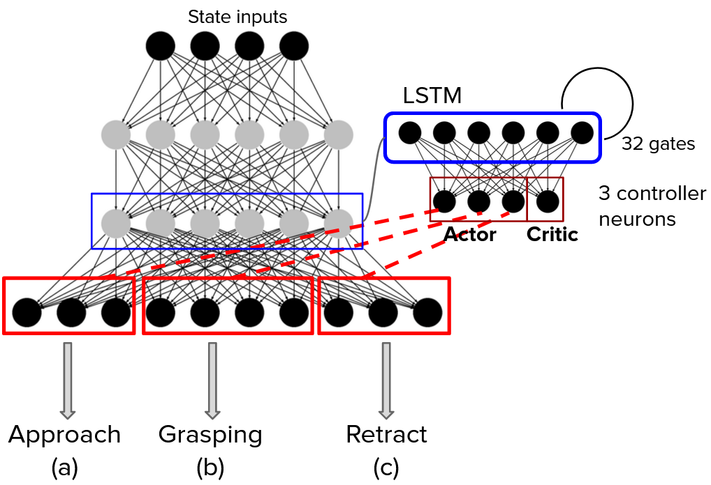
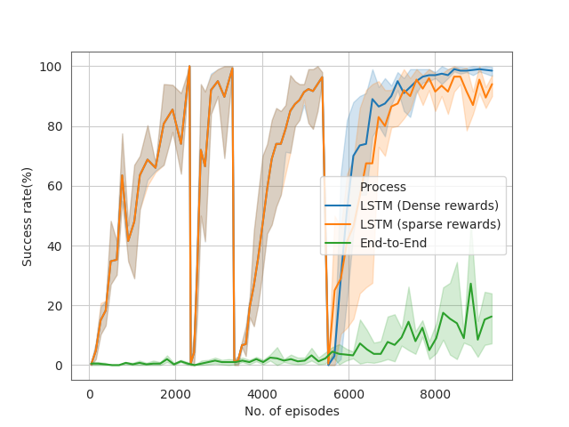

# On Simple Reactive Neural Networks for Behaviour-Based Reinforcement Learning

**[Ameya Pore](https://github.com/Ameyapores) and [Gerardo Aragon-Camarasa](https://github.com/gerac83)**

## Introduction

A framework to generate reactive behaviours, motivated from Subsumption architecture from 1980s. In our archihtecture each  behaviour is represented as a separate module (Deep network), having direct access to processed sensory information. Each module has an individual specific goal. We use a trivial form of imitation learning, called Behaviour cloning, to train these distinct behaviour layers.

 

The primary goal of picking the object is subdivided into simpler subtasks. For each subtask, there are reactive networks which are trained specially for movement in x, y and z. First, the state vector (in the form of coordinates of objects) is given as an input to the Feature extraction layer. The extracted features are relayed on to the reactive layers deciding the movement of the end-effector. To simplify terminology, we use the following corresponding letters for denoting the subordinate actions: Approach (a), manipulate (b) and retract (c).


## Implementation details
### Prerequisites
- Python3.5+
- PyTorch 0.4.0
- OpenAI Gym ==0.10.8
- mujoco physics engine
Here, we use the OpenAI simulator FetchPickandPlace which provides kinematic state vector as an input to our network.
For installing OpenAI fetch simulator: Refer to [Fetch](https://openai.com/blog/ingredients-for-robotics-research/)
### Clone the repository

```
git clone https://github.com/Ameyapores/Reactive-Reinforcement-learning
cd Reactive-Reinforcement-learning
```
### Step 1: Train on approach
Create a folder, named 'train' in the approach directory where the weights would be saved. 
```
cd approach
python main.py
```
After 2500 episodes of training, stop (Ctrl+c)

### Step 2: Train on manipulate
Transfer the saved weights from the approach folder to the folder where manipulate weights would be saved. We have a created a folder named 'train' in the manipulate directory.
```
cd manipulate
python main.py
```
After 2000 episodes of training, stop.
### Step 2: Train on retract
Transfer the saved weights from the manipulate folder to the folder where retarct weights would be saved. We have created a folder named 'train' in the retract directory.
```
cd retract
python main.py
```
After 3000 episodes of training, stop.

### Step 2: Train of chereographing the actions using LSTM
Transfer the saved weights from the retract folder to a new folder in the LSTM directory (named save). Also, create a seperate folder named train to save the weights of the Actor-critic. 
```
cd LSTM
python main3.py
```
After 2000 episodes of training, stop.
## Results
 

Comparison of end-to-end learning vs proposed reactive Reinforcement architecture.

 
